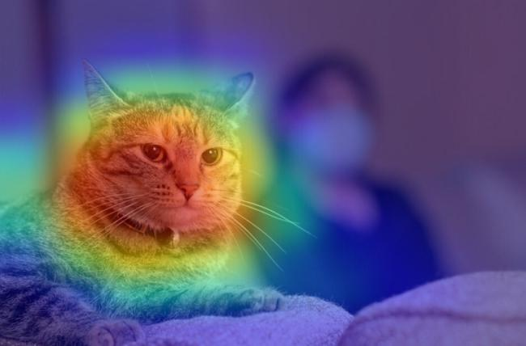

# Ablation-CAM: Visual Explanations for Deep Convolutional Network via Gradient-free Localization - Paper Implementation  

This folder contains the Paper Implementation of Ablation cam  

@INPROCEEDINGS{9093360,  author={S. {Desai} and H. G. {Ramaswamy}},   booktitle={2020 IEEE Winter Conference on Applications of Computer Vision (WACV)},     title={Ablation-CAM: Visual Explanations for Deep Convolutional Network via Gradient-free Localization},     year={2020},  volume={},  number={},    pages={972-980},}    

I have tried implementing the paper from scratch using Python language and Keras framework.  

This folder contains:- 
<ul> 1) Ablation Cam - where all the code and results are stored.  </ul>
<ul> 2) Ablation Cam Different Approach - The code to a different approach of implemeting the paper which has been explained in the summary sheet properly  </ul>
<ul> 3) Research Paper - This folder contains the Original Research Paper which I have implemented.  </ul>
<ul> 4) Finally the Summary sheet where all the explaination, Result, and Analysis is done (The paper is written in LATEX format)  </ul>

The main Implementation has been done on XCEPTION model(pre-trained) and Custom model trained on CIFAR-10  

Finally the model is compared with the current SOTA GradCam model and is found that Ablation Cam performs better in some cases which have been discussed in the summary sheet separately.  

# Visualization

   

